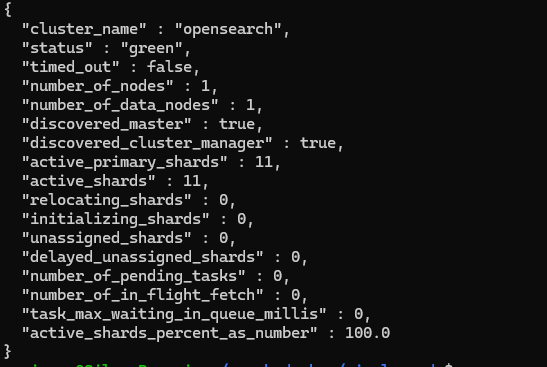

+++
title = "Lab #4 – Wazuh Single-Node Deployment with Docker"
slug = "wazuh-docker-deployment"
date = "2025-08-30T10:00:00-04:00"
author = "RoninSec"
cover = "banner.png"
tags = ["wazuh", "docker", "siem", "sysmon", "blue-team"]
keywords = ["Wazuh", "Docker", "SIEM", "Elastic replacement", "Sysmon"]
description = "Step-by-step guide to deploying Wazuh in Docker (single node), setting up certificates, fixing common authentication errors, and preparing a Win10 endpoint with Sysmon for telemetry."
showFullContent = false
readingTime = true
hideComments = false
draft = false
+++

# Overview

This lab focused on standing up a **single-node Wazuh stack using Docker**.  
Unlike my Elastic experiments, this setup gives me a **self-contained SIEM** (Indexer + Manager + Dashboard) and will serve as the foundation for future detection engineering.

The goal: deploy Wazuh, resolve authentication issues, and prepare a Windows endpoint with Sysmon for later integration.

---

# Step 1 – Clone Wazuh Docker Repository

```bash
git clone https://github.com/wazuh/wazuh-docker.git -b v4.12.0
cd wazuh-docker/single-node

Install Docker Compose:

sudo apt install docker-compose
```

# Generate indexer certificates:
``` bash
docker-compose -f generate-indexer-certs.yml run --rm generator
```
# Step 2 – Fixing Authentication & Passwords

After the initial run, (Followed the documentation on Wazuh's setup Page by the way) I was able to log in using the default creds, when following the steps on setting my own password I ran into some issues. I hit authentication failures: the dashboard would not launch and the indexer rejected logins.

Since I tried to follow the documentation and nothing worked I decided to wipe and start fresh, again it still wouldn't work so I did the following:

* I recreated the container 
``` bash 
sudo docker compose up -d --force-recreate wazuh.indexer
```
### The missing piece was resetting credentials directly inside the indexer container with the securityadmin.sh tool:

sudo docker exec -it single-node-wazuh.indexer-1 bash -lc '
export INSTALLATION_DIR=/usr/share/wazuh-indexer
export JAVA_HOME=/usr/share/wazuh-indexer/jdk
$INSTALLATION_DIR/plugins/opensearch-security/tools/securityadmin.sh \
  -cacert $INSTALLATION_DIR/certs/root-ca.pem \
  -cert   $INSTALLATION_DIR/certs/admin.pem \
  -key    $INSTALLATION_DIR/certs/admin-key.pem \
  -cd     $INSTALLATION_DIR/opensearch-security/ \
  -icl -nhnv -h localhost -p 9200'

### This is the output I received after running the above


✅ This successfully repopulated all the OpenSearch security configs (config.yml, roles.yml, internal_users.yml, etc.).

### Confirm connectivity with the new admin password:

curl -k -u 'admin:<NEW_ADMIN_PASSWORD>' https://localhost:9200/_cluster/health?pretty

## Step 3 – Start Containers

Bring everything up:
```bash
sudo docker compose up -d
```
You should see:
* wazuh.manager
* wazuh.indexer
* wazuh.dashboard

## Running and reachable. Dashboard is available at:
👉 https://localhost:5601

## Step 4 – Prepare Windows Endpoint
* Spun up a new Win10 VM (W10T2).
* Installed Sysmon with SwiftOnSecurity’s config:

```cmd
C:\Users\Target\Downloads\Sysmon64.exe -accepteula -i .\sysmonconfig-export.xml
```

This ensures detailed process/registry/file telemetry is available once the Wazuh Agent is installed.

## Confirmed Sysmon alerts were showing up in Wazuh
[WazuhSysmon](WazuhSysmon.png)
## Gotchas
    Authentication errors: Resolved only after running securityadmin.sh inside the Indexer container.

    Directory confusion: The script path (/usr/share/wazuh-indexer/...) doesn’t exist on the host — you must exec into the container.

    Dashboard won’t load: This was always tied back to failed user/role configs; re-seeding them fixed it.

Useful Commands

# Tear down containers
```bash
sudo docker compose down
```
# Recreate containers
```bash
sudo docker compose up -d --force-recreate
```
# Enter indexer container
```bash
sudo docker exec -it single-node-wazuh.indexer-1 bash
```

## Wrap-Up
At this stage, Wazuh is up and stable in Docker, and my Win10 test VM is running Sysmon.
Next step: install the Wazuh Agent on the VM, connect it to the manager, and confirm events flow into the dashboard.

## ⚡ Takeaway: This lab was less about detection, more about infrastructure plumbing. Fixing the credential issue taught me how Wazuh security configs actually work — knowledge that will be critical once I start building rules and alerts.